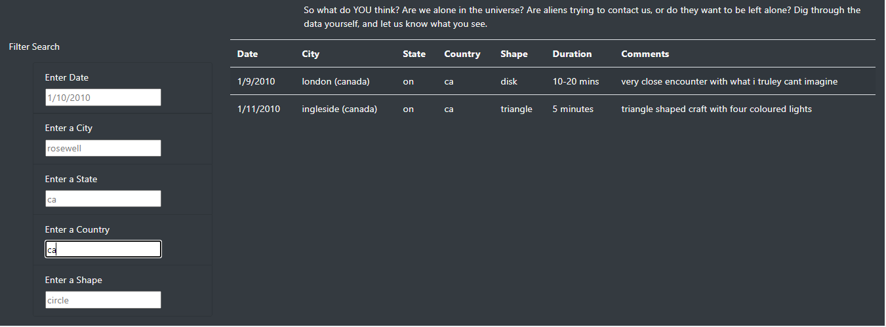

# UFO Sightings - Fact or Fancy

## Project Overview:
The web page UFO Sightings is created using JavaScript and allow users to review UFO sighiting data and apply data filets on it.

The filter are provided on following key data elements:

1. Date of sighting
2. Location:
    - City
    - State
    - Country
3. Shape of the object sighted

## Solution overview:

- Data file [JSON data file](js/data.js)
- Image file [Iamge file used](static/images/nasa.jpg)
- Software:
    - JavaScript
    - html
    - Bootstrap CDN
    - D3

## Results:

User can use the search criterai to filter UFO sighting data . Some of the exmpales are

### Filtering by single data elememnt:

User can search the UFO sighting using any one of the data element by entering a value in the input box. 

#### Filtering data by Date:

#### Filtering data by Country:

### Filtering by more than one element

User can search the UFO sighiting by providing search criteria for more than one data element.

#### Filtering data by Date and Country:

#### Filtering data by Shape and Country:

### Removing a filter

User can remove filter by removing the search box contents using backspace or delete keyboard buttong. Basically if the value in the serachbox is empty string then fitler is removed.

## Summary:

### Drawbacks of current design:
There are multiple drawback of this new design. e.g:

1. In order to remove all filters, users have to either manualy delete values from search boxex or refresh the full page.
2. The search for text vlaues like City, State, Country and Shape are case sensitive. So if user try to search for country "US" the it will return 0 records. 
3. Date filter allow user to review data for single data only. If user want to search for a period of time then they have to do one day at a time.
4. If user scroll the page, the the titles, navigation bar and filter boxes doesn't move . So user have to scorll up again to get to filter boxex , navigation etc.
5. Have to create a separeate ETL process to refresh data.js to get more up to date UFO sighiting data.

### Future development suggestions:

Based on the above mentioned draw back following items should be consideted for future develpment.

1. Reomve case senitivity when searching text data elemenrts. i.e conver input and data value to all upper or all lower before applying filter.
2. Change date filter so that it can pick date from a caledar.
3. Allow searching for a period of days rather than signle data at a time.
4. Change the table format such that it either scroll within table only but keep all other content visible . so scroll rows within the table, but keep Filter criteria , navigation bar visibale.
5. Create a process to scrape the latest UFO sighting data from web and show it in "UFO Sightings" web application.
